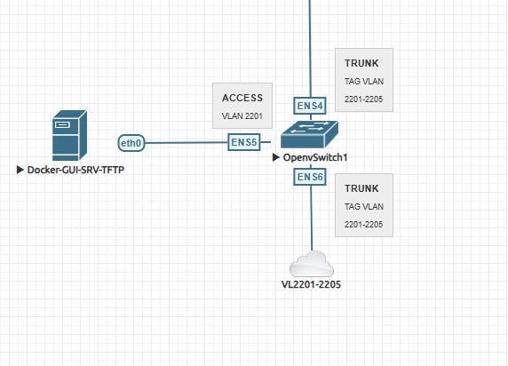

# Open vSwitch VLAN Bridge Setup

This repository contains scripts and configuration files to set up an Open vSwitch (OVS) bridge for a host with VLAN trunking and access ports.

## Topology

- `ens4` and `ens6`: Trunk ports carrying VLANs 2201–2205
- `ens5`: Access port on VLAN 2201, used for management (IP: `10.10.3.2/24`)

- The diagram:



## Files

- `setup-ovs.sh`: Configures the OVS bridge and ports
- `setup-ovs.service`: systemd unit to automatically apply the OVS setup on boot
- `netplan/01-netcfg.yaml`: Netplan config to assign an IP address on VLAN 2201

## ⚠️ Important

> **Note**: The IP addresses, VLAN IDs, and interface names in the YAML and setup script are specific to one environment.
>
> You **must update** these values to match your network infrastructure:
>
> - IP address (`10.10.3.2/24`) → your desired management IP
> - VLANs (`2201–2205`) → your VLAN range
> - Interfaces (`ens4`, `ens5`, `ens6`) → your actual NIC names

---

## Installation Instructions

### 1. Install OVS

```bash
sudo apt update
sudo apt install -y openvswitch-switch openvswitch-common
```

### 2. Copy Setup Script

```bash
sudo cp setup-ovs.sh /usr/local/bin/
sudo chmod +x /usr/local/bin/setup-ovs.sh
```

### 3. Install systemd Service

```bash
sudo cp setup-ovs.service /etc/systemd/system/
sudo systemctl daemon-reload
sudo systemctl enable setup-ovs.service
```

### 4. Configure Netplan

Make sure your Netplan YAML includes a dummy bridge `br0` definition (as shown below):

```yaml
network:
  version: 2
  renderer: networkd

  ethernets:
    ens3:
      dhcp4: false
      addresses: [10.0.22.3/24]

  bridges:
    br0:
      interfaces: []
      optional: true
      dhcp4: false

  vlans:
    br0.2201:
      id: 2201
      link: br0
      addresses: [10.10.3.2/24]
      nameservers:
        addresses: [10.10.3.22, 8.8.8.8]
      routes:
        - to: 0.0.0.0/0
          via: 10.10.3.1
```

Then apply it:

```bash
sudo cp netplan/01-netcfg.yaml /etc/netplan/
sudo netplan apply
sudo systemctl restart systemd-networkd
```

### 5. Reboot the Host

```bash
sudo reboot
```

---

## Validation Steps

After rebooting:

1. Check if bridge `br0` and VLAN interface `br0.2201` are up:
   ```bash
   ip addr show br0
   ip addr show br0.2201
   ```

2. Test IP connectivity:
   ```bash
   ping 10.10.3.1
   ```

3. Test SSH access to `10.10.3.2` from another host.

4. Check Open vSwitch config:
   ```bash
   sudo ovs-vsctl show
   ```

---

## Troubleshooting

- **Error: "interface br0 is not defined"**
  - Ensure you include a placeholder `br0` under `bridges:` in Netplan as shown above.

- **OVS Error: "could not add network device br0 to ofproto (file exists)"**
  - This may occur if the interface is already managed by another service or leftover from a failed configuration.
  - Reboot the system or manually remove the bridge with:
    ```bash
    sudo ovs-vsctl --if-exists del-br br0
    ```

- **`systemd-networkd-wait-online` stalls or fails**
  - This is often caused by Netplan waiting for `br0`, which isn't fully configured yet.
  - Use `optional: true` in the Netplan bridge definition to avoid blocking boot.

---

## Requirements

- Ubuntu system with Open vSwitch installed
- `systemd-networkd` as the Netplan renderer

---

## License

MIT License
